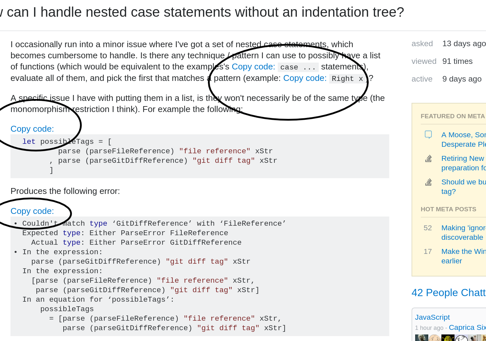

# cutcode

Chrome and Firefox extension to copy code snippet from code blocks via double clicking / anchor link.



stackoverflow.com works by default - other sites may work, but may need some modification to the code.

## Getting Started

### Installing

Available on the [Firefox Add-ons site](https://addons.mozilla.org/en-US/firefox/addon/cutcode/).


- Clone the repo.

  ```shell
  git clone https://github.com/amitness/cutcode
  ```
  
  ### Installing on Chrome

- Load the extension into Google Chrome as an Unpacked Extension:

  
  - Navigate to (1a) chrome://extensions or (1b) select Menu > More Tools > Extensions.
  - Enable the (2) developer mode at top right.
  - Click (3) "Load Unpacked Extension".
  - Navigate to the cloned folder.  
  For additional help, refer the [official guide for Chrome](https://developer.chrome.com/extensions/getstarted#unpacked).
  
  
	

  ### Installing on Firefox
- Load the extension into Firefox as a Temporary Add-on:

    - Open Firefox
    - Enter (1) "about:debugging" in the URL bar
    - Click (2) "Load Temporary Add-on"
    - Open the cloned directory and select any file inside the folder.  
    For additional help, refer the [official guide for Firefox](https://developer.mozilla.org/en-US/Add-ons/WebExtensions/Temporary_Installation_in_Firefox).
  
	

### License

This project is licensed under the GNU License - see the [LICENSE](LICENSE) file for details.

Icon provided by [Open Iconic](http://www.useiconic.com/open).

### References
- [Copy & Paste & The Web : CSS-Tricks](https://css-tricks.com/copy-paste-the-web/)
- [Double Click Event Handler: Stack Overflow](http://stackoverflow.com/questions/6462909/how-to-add-doubleclick-event-to-canvas-element-using-the-addeventlistener-meth)
